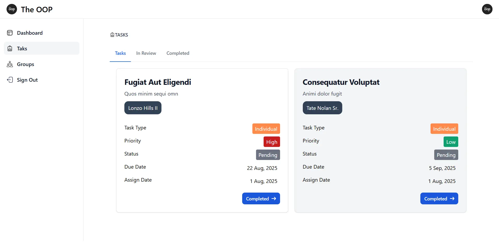

## Task Management System

This project is a full-featured Task Management System built with **Laravel** (backend) and **Vue.js** (frontend). It is designed for startups and small businesses to manage tasks, teams, and productivity efficiently.

---

### ✨ Features

- **Admin Panel**
  - Manage employees, tasks, categories, and groups
  - Assign tasks to individuals or groups
  - View dashboard statistics (employees, tasks, categories, groups)
  - Category and group management
  - Password change for users

- **Employee Dashboard**
  - View assigned tasks by status (pending, review, complete)
  - Mark tasks as complete or move to review
  - View group memberships

- **Task Management**
  - Tasks have statuses (Pending, Review, Complete) and priorities (High, Medium, Low)
  - Assign tasks to users or groups
  - Organize tasks by categories

- **Notifications**
  - Email notifications sent on employee creation
  - Toast notifications for actions (task update, creation, deletion, etc.)

- **UI and UX**
  - Responsive UI using **Flowbite-Vue** and **Tailwind CSS**
  - Clean and user-friendly design
  - Role-based authentication and route protection

- **Performance**
  - Caching for faster response
  - Background jobs for async email delivery

---

### ⚙️ Laravel Features Used

- **Eloquent ORM** for database models and relationships
- **Migrations** for schema management
- **Controllers & Requests** for business logic and validation
- **API Resources** for structured API responses
- **Jobs & Queues** for sending emails in the background
- **Caching** with `Cache::remember` for optimization
- **Authentication & Authorization** with guards and middleware
- **Mail** for notifications
- **Form Request Validation** for clean input handling

---

### 🚀 Setup Instructions

Follow the steps below to get the project up and running on your local machine.

#### 1. Clone the Repository

```bash
git clone https://github.com/kamrankhan001/task-management.git
cd task-manager
```

#### 2. Install Dependencies

Install PHP and JavaScript dependencies:

```bash
composer install
npm install
```

#### 3. Environment Setup

Copy the example `.env` file and configure it:

```bash
cp .env.example .env
```

Update the `.env` file with your database and mail credentials.

#### 4. Generate Application Key

```bash
php artisan key:generate
```

#### 5. Run Migrations and Seed Database (optional)

```bash
php artisan migrate --seed
```

> You can add seeders for default admin or dummy users if required.

#### 6. Compile Frontend Assets

```bash
npm run dev
```

#### 7. Start the Development Server

```bash
php artisan serve
```

Then visit: [http://localhost:8000](http://localhost:8000)

---

### 📌 Folder Structure Highlights

- `app/Models` - Eloquent models (User, Task, Group, etc.)
- `app/Http/Controllers/Admin` - Backend logic for admin routes
- `resources/js` - Vue.js components
- `resources/views` - Blade views and layouts
- `routes/api.php` - API routes for frontend communication
- `public/` - Public assets and screenshots

---

---

### 📦 Future Improvements

- Add Kanban board for visual task movement
- Real-time notifications using Laravel Echo and Pusher
- File uploads and attachments for tasks
- Export tasks as CSV or PDF
- Calendar view for task scheduling

---

### 🧑‍💻 License

This project is open-source and available under the [MIT license](LICENSE).

---

### 📷 Preview


---

### 📫 Contact

For suggestions, improvements, or collaborations, feel free to [reach out](mailto:kamran.khan.developer@gmail.com) or [connect on website](https://kamrankhan.dev).
